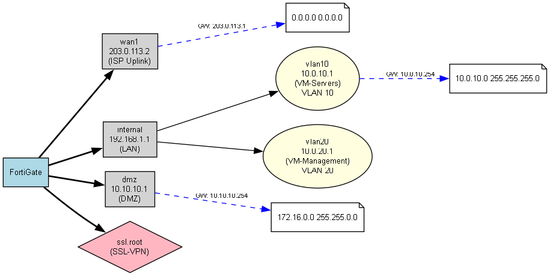

<div align="center">

# FortiGraph

### Instant network topology visualization for FortiGate firewalls

[](https://www.python.org/)
[](https://flask.palletsprojects.com/)
[](LICENSE)
[](https://graphviz.org/)

Upload a `.conf` file. Get an interactive topology diagram. That's it.



</div>

---

## What it does

FortiGraph parses FortiGate backup configuration files and renders a fully interactive, browser-based network topology diagram — no Graphviz installation required, no cloud uploads, no setup beyond `pip install`.

It extracts interfaces, VLANs, tunnels, static routes, and firewall policies directly from your `.conf` file and builds a graph you can zoom, pan, and explore.

---

## Features

- **Browser-native rendering** — Graphviz runs as WebAssembly in the browser. Nothing to install locally.
- **Privacy first** — Config files are parsed on your own machine and never leave it.
- **Full topology coverage** — Physical interfaces, VLANs, tunnels, static routes, and firewall policies all parsed.
- **Clean, modern UI** — Dark theme, drag-and-drop upload, smooth animated transitions.
- **CLI mode** — Run headless from the terminal and export a `.dot` / `.png` directly.

---

## Quick Start

```bash
# 1. Clone
git clone https://github.com/yuvalg72/FortiGraph.git
cd FortiGraph

# 2. Install dependencies
pip install -r requirements.txt

# 3. Run
python src/app.py
```

Open [http://localhost:5000](http://localhost:5000), drag in your FortiGate `.conf` file, and the topology renders instantly.

> **Debug mode** is off by default. To enable it: `FLASK_DEBUG=true python src/app.py`

---

## CLI Usage

To export a diagram without the web UI:

```bash
python src/main.py path/to/backup.conf
```

Outputs `fortigraph_topology.dot` and `fortigraph_topology.png` in the current directory.

---

## Topology Legend

| Shape | Color | Represents |
|---|---|---|
| Rectangle | Grey | Physical interface |
| Ellipse | Yellow | VLAN (connected to parent port) |
| Diamond | Pink | Tunnel interface |
| Note | White | Static route destination network |

| Edge style | Meaning |
|---|---|
| Solid bold | Interface connected to FortiGate |
| Solid thin | VLAN / tunnel → parent interface |
| Dashed blue | Static routing path (labeled with gateway IP) |

---

## Architecture

```
.conf file
    │
    ▼
parser.py          ← extracts interfaces, routes, policies
    │
    ▼
graph_builder.py   ← builds a NetworkX directed graph
    │
    ▼
visualizer.py      ← generates Graphviz DOT source
    │
    ▼
index.html         ← renders DOT via d3-graphviz (WASM) in the browser
```

---

## Tech Stack

- **Backend** — Python, Flask, NetworkX, Graphviz
- **Frontend** — Vanilla JS, D3.js, [@hpcc-js/wasm](https://github.com/hpcc-systems/hpcc-js-wasm), [d3-graphviz](https://github.com/magjac/d3-graphviz)

---

## License

[MIT](LICENSE) — use it, fork it, build on it.
